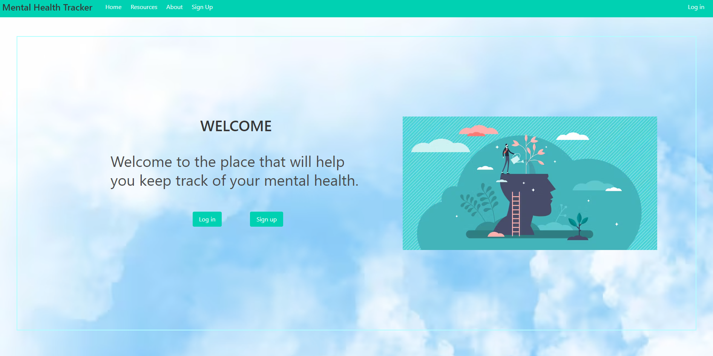
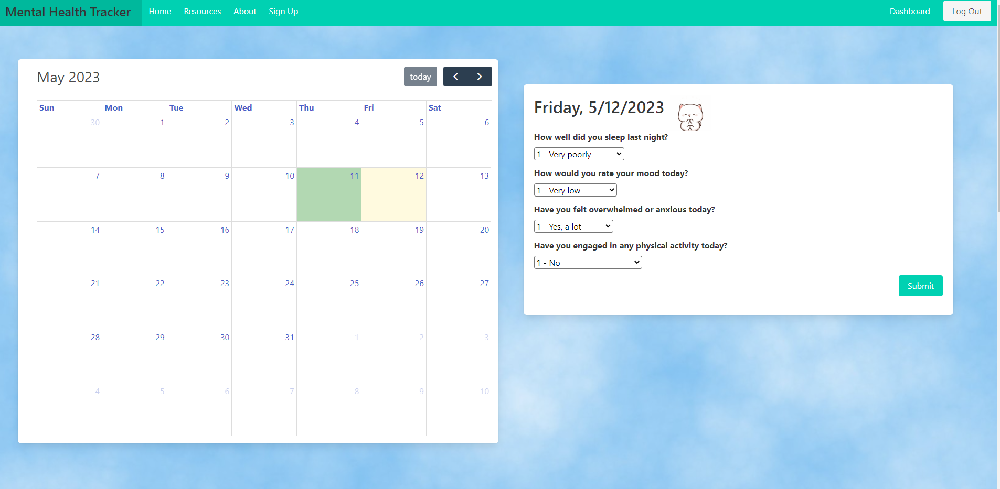
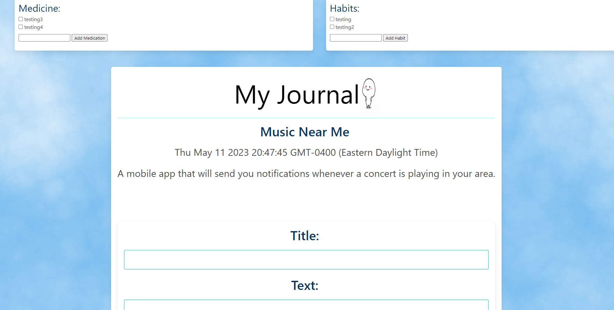
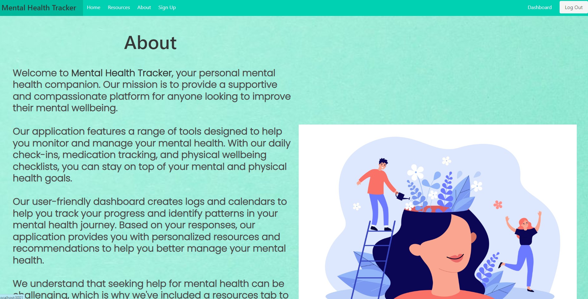

# Mental-Health-Tracker-
   
  ## Description
   This project helps the user track their mental health with medication intake tracker, inspirational quotes, a calendar to track good days and bad days, input journal entries, and links to several helpline websites and call information. Mental health tracker is a great way to help the user in many different ways and aims to decrease negative effects on oneself. So many people suffer from some sort of mental health problems and not many feel like they have the information needed to get the help they need, or have a way to try to control the problems they have. Hopefully this application will help users maintain a healthy mind.
  ## Table of Contents
  
  - [Installation](#installation)
  - [Usage](#usage)
  - [Credits](#credits)
  - [License](#license)
  
  ## Installation
   To use this application correctly, you will need to install Node.js and then run NPM i to install bcrypt, connect-session-sequelize, dotenv, express, express-handlebars, express-session, mysql2, sequelize, and uuid.
  ## Usage
   This application will provide the user with the ability to keep track of their mental health better, and easily access the necessary help they need so they don't feel like they are alone.
   

  ## Credits
   This application was created by a group of people from class as a project. We also had assistance from our TAs, instructor, and from Google.
   
[David Peguero](https://github.com/DavidPeguero)

[Dylan Yong](https://github.com/Suzakijun1)

[Julio Alvarez](https://github.com/jalvarez322)

[Sami Sweet-Kloid](https://github.com/sweetkloid)

[Brandon Morgan](https://github.com/brandon6457)

  ## License
  [license:MIT](https://opensource.org/licenses/MIT/)
  ## Features
   This application has access to three websites that deal with mental health issues as well as contact information, a calendar to track good and bad days, a journal to write in, inspirational quotes, a medication input tracker, and a wellbeing tracker.
  ## How to Contribute
   Anyone can contribute by adding more features to the application to make it easier and more efficient in the future.
  ## Tests
   N/A
  ## Contact
  github: [DavidPeguero](https://github.com/DavidPeguero/Mental-Health-Tracker)
  email: example-email@example.com